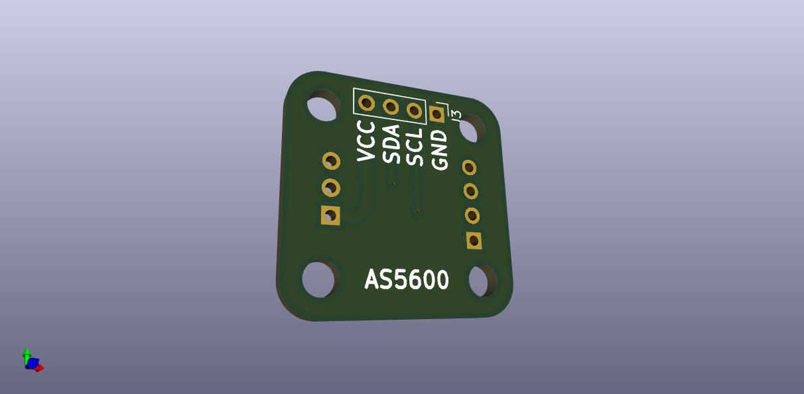
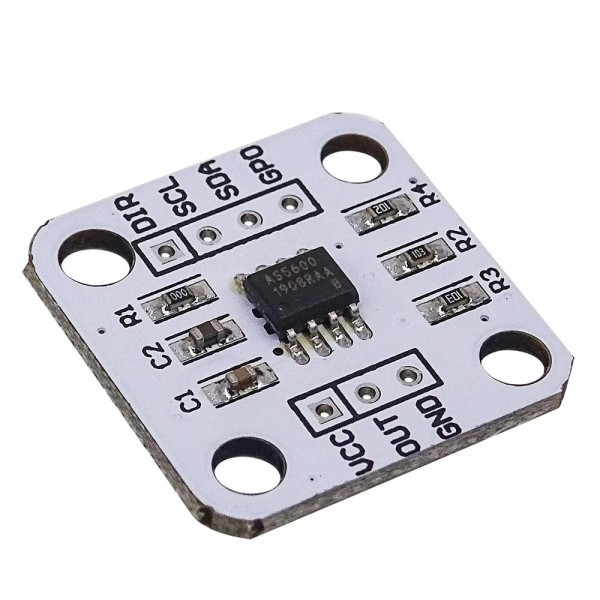

# AS5600-adapter

A tiny breakout PCB that re-maps the AS5600 magnetic angle sensor module's
awkward pin layout onto a standard, easier-to-wire 1x4 header — commonly
sold AS5600 boards break out `VCC/GND/SCL/SDA` (plus OUT/DIR pins) in an
order that doesn't play well with standard jumper cables or a solderless
breadboard.

## What it is

A passive adapter PCB (no active components) with two headers:

- `J1`/`J3` — 1x4 pin headers
- `J2` — 1x3 pin header

Populate per the BOM below and mount the commercial AS5600 module on one
side; the adapter re-orders its pins to a clean pinout on the other side.
See `encoder-adapter.kicad_sch` / `encoder-adapter.kicad_pcb` for the exact
net mapping if you need to confirm pin-for-pin before soldering.

## Bill of materials

From [`production/bom.csv`](production/bom.csv):

| Designator | Footprint | Qty | Value |
|---|---|---|---|
| J1, J3 | PinHeader 1x04, 2.54mm, vertical | 2 | Conn_01x04 |
| J2 | PinHeader 1x03, 2.54mm, vertical | 1 | Conn_01x03 |

## Fabrication

`production/` contains the JLCPCB-ready gerbers, drill files, BOM and
pick-and-place (`encoder-adapter.zip`) — upload that zip directly to
JLCPCB, PCBWay, or similar. The board is 2-layer, through-hole only, no
SMT assembly required.

## Use

Wire the AS5600 module to the adapter's headers per the KiCad schematic,
then use the adapter's re-ordered header to connect I2C (`SCL`/`SDA`) and
power to your microcontroller of choice — the AS5600 itself is a standard
I2C 12-bit magnetic angle sensor, addressable at `0x36`.
